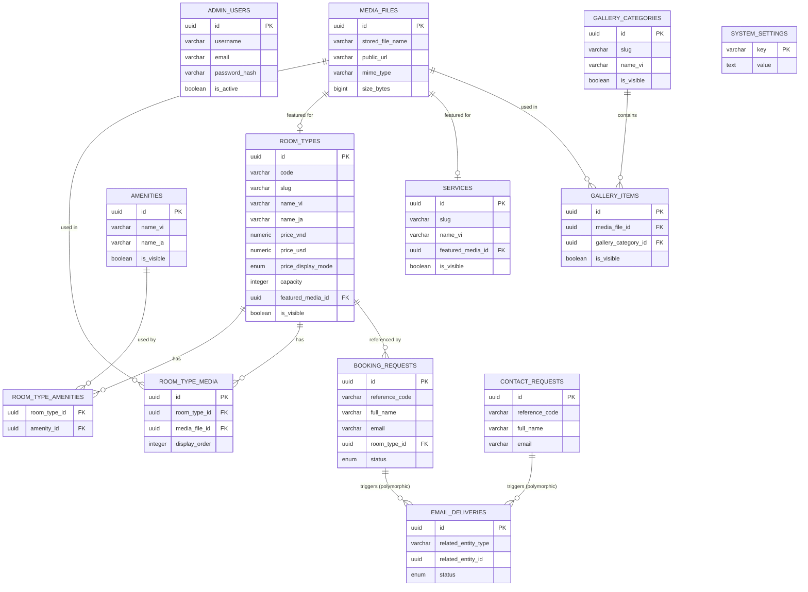

# HBP — Hoàn thiện tài liệu & Thiết kế Database Schema

| Thông tin | Giá trị |
|---|---|
| Tài liệu gốc | Hotel Booking Portal — SRS v0.9 |
| Loại tài liệu | Addendum — Technical Decisions & Database Schema |
| Phiên bản | 1.0 |
| Ngày cập nhật | 15/07/2026 |

Tài liệu này bổ sung cho SRS v0.9: giải quyết các nội dung `TBD-TECH` ở Mục 30, làm rõ kiến trúc triển khai, và thiết kế đầy đủ schema PostgreSQL dựa trên Mục 13 (Yêu cầu dữ liệu).

---

# Phần 1 — Cập nhật Mục 30: Giải quyết các nội dung TBD-TECH

Các mục dưới đây được chia thành 2 nhóm: **Đã chốt** (có thể quyết định dựa trên yêu cầu kỹ thuật/best practice) và **Cần xác nhận thêm** (phụ thuộc quyết định kinh doanh, thương hiệu, hoặc nhà cung cấp mà tài liệu chưa có đủ thông tin).

| Mã | Nội dung | Quyết định đề xuất | Trạng thái |
|---|---|---|---|
| TBD-TECH-001 | Framework frontend | **Next.js** (App Router), rendering SSG/ISR cho toàn bộ trang public (không có trang cần data real-time) | Đã chốt |
| TBD-TECH-002 | Framework backend | **ASP.NET Core Web API (.NET 8)** | Đã chốt |
| TBD-TECH-003 | Database | **PostgreSQL 16** | Đã chốt |
| TBD-TECH-004 | Cơ chế authentication | **Cookie-based session** (ASP.NET Identity hoặc custom, cookie `HttpOnly` + `Secure` + `SameSite=Lax`). Do Admin Portal chỉ có 1 tài khoản và không cần chia sẻ token cross-domain phức tạp, cookie-session đơn giản và an toàn hơn JWT cho MVP. Nếu sau này tách Admin Portal sang subdomain riêng, cần đánh giá lại (có thể cần `SameSite=None` + JWT) | Đã chốt (đề xuất) |
| TBD-TECH-005 | SMTP provider | Cần xác nhận nhà cung cấp cụ thể. Gợi ý 2 hướng: (1) SMTP relay từ nhà cung cấp email hiện có của khách sạn, (2) dịch vụ transactional email (Amazon SES, SendGrid, hoặc tương đương) — ưu điểm là có dashboard theo dõi deliverability, phù hợp với yêu cầu retry/tracking ở Mục 15 | **Cần xác nhận thêm** |
| TBD-TECH-006 | Dung lượng tối đa mỗi ảnh | Đề xuất **5MB/file** — đủ cho ảnh chất lượng cao đã nén, không quá tải storage | Đã chốt (đề xuất) |
| TBD-TECH-007 | Kích thước ảnh tối thiểu | Đề xuất tối thiểu **1200×800px** cho ảnh đại diện (đảm bảo chất lượng hiển thị responsive), không giới hạn với ảnh gallery phụ | Đã chốt (đề xuất) |
| TBD-TECH-008 | Chính sách resize/thumbnail | Đề xuất tự động tạo 3 phiên bản khi upload: `thumbnail` (400px), `medium` (800px), `original` (giữ nguyên, chỉ convert sang WebP để tối ưu). Phục vụ đúng Mục 19 (không tải ảnh gốc trong danh sách) | Đã chốt (đề xuất) |
| TBD-TECH-009 | Thời hạn phiên đăng nhập | Đề xuất **8 giờ** (idle timeout hoặc absolute), phù hợp ca làm việc hành chính | Đã chốt (đề xuất) |
| TBD-TECH-010 | Số lần đăng nhập sai trước khi khóa | Đề xuất **5 lần sai trong 15 phút → khóa tạm 15 phút** | Đã chốt (đề xuất) |
| TBD-TECH-011 | Thời gian lưu Booking Request | Đề xuất **lưu vô thời hạn** (là hồ sơ giao dịch kinh doanh, dùng cho thống kê/đối chiếu về sau), có thể archive sau 2-3 năm nếu cần | Đã chốt (đề xuất) |
| TBD-TECH-012 | Thời gian lưu Contact Request | Tương tự Booking Request — lưu vô thời hạn hoặc archive sau 1-2 năm | Đã chốt (đề xuất) |
| TBD-TECH-013 | Thời gian lưu EmailDelivery | Đề xuất **giữ 90 ngày** rồi có thể xóa/archive (đây là log kỹ thuật, không phải dữ liệu nghiệp vụ chính) | Đã chốt (đề xuất) |
| TBD-TECH-014 | Chính sách backup chính thức | Theo Mục 22: **backup hằng ngày, giữ tối thiểu 7 bản gần nhất**, backup cả database và media volume, lưu ngoài container | Đã chốt |
| TBD-TECH-015 | Domain và cấu trúc môi trường | Đề xuất: `www.<domain>` (Public Website VI/JA), `www.<domain>/admin` (Admin Portal — dùng chung domain với Public, khác route, giúp cookie same-site đơn giản hơn), `api.<domain>` (Backend API). Môi trường staging dùng subdomain riêng, VD `staging.<domain>` | **Cần xác nhận thêm** (tên domain thật) |
| TBD-TECH-016 | Cấu hình máy chủ production | Với tải ước tính dưới 50 concurrent users: tối thiểu **2 vCPU / 4GB RAM / 40-60GB SSD**, có swap 2-4GB | Đã chốt (đề xuất) |
| TBD-TECH-017 | Nội dung và thiết kế email chính thức | Cần bộ phận vận hành/marketing khách sạn cung cấp nội dung, tone giọng, logo cho email template | **Cần xác nhận thêm** |
| TBD-TECH-018 | Bộ nhận diện thương hiệu | Cần khách sạn cung cấp (logo, màu sắc, font) | **Cần xác nhận thêm** |
| TBD-TECH-019 | Trình duyệt tối thiểu hỗ trợ | Đề xuất: 2 phiên bản gần nhất của Chrome, Safari, Edge, Firefox; Safari iOS và Chrome Android bản hiện hành | Đã chốt (đề xuất) |
| TBD-TECH-020 | Công cụ monitoring và logging | Với quy mô hạ tầng nhỏ (VPS đơn, Coolify), đề xuất dùng log tích hợp sẵn của Coolify + có thể bổ sung Uptime Kuma (nhẹ, self-hosted) cho health check/alerting, tránh triển khai stack nặng như ELK | Đã chốt (đề xuất) |

> Các mục "Cần xác nhận thêm" không thể quyết định thay khách sạn/đội dự án vì liên quan trực tiếp đến ngân sách nhà cung cấp, thương hiệu, hoặc nội dung kinh doanh — cần được xác nhận trước khi vào giai đoạn phát triển chính thức.

---

# Phần 2 — Ghi chú bổ sung về kiến trúc triển khai (liên quan Mục 23.2)

Container đề xuất tại Mục 23.2 gồm `frontend, backend, database, reverse-proxy, email-worker, backup`. Bổ sung làm rõ:

- **email-worker**: với ASP.NET Core, khuyến nghị triển khai dưới dạng `BackgroundService`/`IHostedService` **nhúng chung process với backend**, không tách container riêng. Điều này giảm 1 container cần quản lý, đơn giản hóa cấu hình mạng nội bộ, và phù hợp với tải thấp (dưới 50 concurrent users) — tách riêng chỉ cần thiết khi khối lượng email tăng cao đủ để ảnh hưởng hiệu năng API.
- **backup**: không chạy liên tục — triển khai dưới dạng cron job hoặc scheduled task trong Coolify (Coolify có hỗ trợ scheduled backup cho Database resource), không cần container luôn chạy.
- **reverse-proxy**: Coolify tự quản lý qua Traefik, không cần cấu hình thủ công thêm.

→ Số container thực tế cần vận hành liên tục: **frontend, backend (kèm email-worker nhúng), database** — khớp với phân tích RAM đã thực hiện trước đó (2 vCPU / 4GB RAM là mức khuyến nghị).

---

# Phần 3 — Thiết kế Database Schema PostgreSQL

## 3.1. Sơ đồ quan hệ (ERD)



> `EMAIL_DELIVERIES` liên kết với `BOOKING_REQUESTS` và `CONTACT_REQUESTS` theo mô hình **polymorphic association** (`related_entity_type` + `related_entity_id`), không dùng foreign key trực tiếp — vì 1 cột `related_entity_id` cần tham chiếu đến 2 bảng khác nhau tùy `related_entity_type`. Ràng buộc toàn vẹn dữ liệu cho quan hệ này được xử lý ở application layer, không thể enforce hoàn toàn bằng FK constraint trong PostgreSQL.

## 3.2. Extensions & Custom Types

```sql
-- ============================================
-- EXTENSIONS
-- ============================================
CREATE EXTENSION IF NOT EXISTS pgcrypto;   -- gen_random_uuid()
CREATE EXTENSION IF NOT EXISTS pg_trgm;    -- fuzzy search (ILIKE) cho admin search

-- ============================================
-- ENUM TYPES
-- ============================================
CREATE TYPE price_display_mode AS ENUM ('SHOW_PRICE', 'CONTACT');
CREATE TYPE booking_request_status AS ENUM ('RECEIVED');
CREATE TYPE email_status AS ENUM ('PENDING', 'SENT', 'RETRYING', 'FAILED');
CREATE TYPE language_code_enum AS ENUM ('vi', 'ja');
```

## 3.3. Functions dùng chung (trigger helpers)

```sql
-- Tự động cập nhật updated_at mỗi khi UPDATE
CREATE OR REPLACE FUNCTION set_updated_at()
RETURNS TRIGGER AS $$
BEGIN
    NEW.updated_at = now();
    RETURN NEW;
END;
$$ LANGUAGE plpgsql;

-- Chuẩn hóa email về lowercase + trim trước khi lưu (BR-CONTENT / ràng buộc Mục 13.13)
CREATE OR REPLACE FUNCTION normalize_email()
RETURNS TRIGGER AS $$
BEGIN
    NEW.email = lower(trim(NEW.email));
    RETURN NEW;
END;
$$ LANGUAGE plpgsql;
```

## 3.4. DDL đầy đủ theo từng entity

### AdminUser

```sql
CREATE TABLE admin_users (
    id             UUID PRIMARY KEY DEFAULT gen_random_uuid(),
    username       VARCHAR(100) NOT NULL,
    email          VARCHAR(255) NOT NULL,
    password_hash  VARCHAR(255) NOT NULL,
    is_active      BOOLEAN NOT NULL DEFAULT TRUE,
    last_login_at  TIMESTAMPTZ,
    created_at     TIMESTAMPTZ NOT NULL DEFAULT now(),
    updated_at     TIMESTAMPTZ NOT NULL DEFAULT now()
);

CREATE UNIQUE INDEX uq_admin_users_username_lower ON admin_users (lower(username));
CREATE UNIQUE INDEX uq_admin_users_email_lower ON admin_users (lower(email));

CREATE TRIGGER trg_admin_users_updated_at
    BEFORE UPDATE ON admin_users
    FOR EACH ROW EXECUTE FUNCTION set_updated_at();

CREATE TRIGGER trg_admin_users_normalize_email
    BEFORE INSERT OR UPDATE ON admin_users
    FOR EACH ROW EXECUTE FUNCTION normalize_email();
```

> Dùng unique index trên `lower(username)`/`lower(email)` thay vì `UNIQUE` constraint thuần, để tránh trường hợp trùng email chỉ khác chữ hoa/thường (VD: `Admin@hotel.com` và `admin@hotel.com`).

### MediaFile

```sql
CREATE TABLE media_files (
    id                  UUID PRIMARY KEY DEFAULT gen_random_uuid(),
    original_file_name  VARCHAR(255) NOT NULL,
    stored_file_name    VARCHAR(255) NOT NULL,
    storage_path        VARCHAR(500) NOT NULL,
    public_url          VARCHAR(500) NOT NULL,
    mime_type           VARCHAR(100) NOT NULL,
    size_bytes          BIGINT NOT NULL CHECK (size_bytes >= 0),
    width               INTEGER,
    height              INTEGER,
    alt_text_vi         VARCHAR(255),
    alt_text_ja         VARCHAR(255),
    created_at          TIMESTAMPTZ NOT NULL DEFAULT now()
);
```

### RoomType

```sql
CREATE TABLE room_types (
    id                    UUID PRIMARY KEY DEFAULT gen_random_uuid(),
    code                  VARCHAR(50) NOT NULL,
    slug                  VARCHAR(150) NOT NULL,
    name_vi               VARCHAR(255) NOT NULL,
    name_ja               VARCHAR(255),
    short_description_vi  VARCHAR(500),
    short_description_ja  VARCHAR(500),
    description_vi        TEXT,
    description_ja        TEXT,
    price_vnd             NUMERIC(14,2) CHECK (price_vnd IS NULL OR price_vnd >= 0),
    price_usd             NUMERIC(10,2) CHECK (price_usd IS NULL OR price_usd >= 0),
    price_display_mode    price_display_mode NOT NULL DEFAULT 'CONTACT',
    capacity              INTEGER NOT NULL CHECK (capacity >= 1),
    area_square_meters    NUMERIC(6,2),
    bed_description_vi    VARCHAR(255),
    bed_description_ja    VARCHAR(255),
    featured_media_id     UUID REFERENCES media_files(id) ON DELETE RESTRICT,
    display_order         INTEGER NOT NULL DEFAULT 0 CHECK (display_order >= 0),
    is_visible            BOOLEAN NOT NULL DEFAULT TRUE,
    seo_title_vi          VARCHAR(255),
    seo_title_ja          VARCHAR(255),
    seo_description_vi    VARCHAR(500),
    seo_description_ja    VARCHAR(500),
    created_at            TIMESTAMPTZ NOT NULL DEFAULT now(),
    updated_at            TIMESTAMPTZ NOT NULL DEFAULT now(),
    CONSTRAINT uq_room_types_code UNIQUE (code),
    CONSTRAINT uq_room_types_slug UNIQUE (slug)
);

CREATE TRIGGER trg_room_types_updated_at
    BEFORE UPDATE ON room_types
    FOR EACH ROW EXECUTE FUNCTION set_updated_at();
```

> `featured_media_id` dùng `ON DELETE RESTRICT`: nếu ảnh đang là ảnh đại diện của 1 loại phòng, PostgreSQL sẽ **từ chối lệnh DELETE** ở tầng database — đây là lớp bảo vệ bổ sung cho FR-MEDIA-005 (không cho xóa ảnh đang sử dụng), ngoài kiểm tra ở application layer.

### Amenity

```sql
CREATE TABLE amenities (
    id             UUID PRIMARY KEY DEFAULT gen_random_uuid(),
    name_vi        VARCHAR(150) NOT NULL,
    name_ja        VARCHAR(150),
    icon           VARCHAR(100),
    display_order  INTEGER NOT NULL DEFAULT 0 CHECK (display_order >= 0),
    is_visible     BOOLEAN NOT NULL DEFAULT TRUE,
    created_at     TIMESTAMPTZ NOT NULL DEFAULT now(),
    updated_at     TIMESTAMPTZ NOT NULL DEFAULT now()
);

CREATE TRIGGER trg_amenities_updated_at
    BEFORE UPDATE ON amenities
    FOR EACH ROW EXECUTE FUNCTION set_updated_at();
```

### RoomTypeAmenity (junction table)

```sql
CREATE TABLE room_type_amenities (
    room_type_id   UUID NOT NULL REFERENCES room_types(id) ON DELETE CASCADE,
    amenity_id     UUID NOT NULL REFERENCES amenities(id) ON DELETE CASCADE,
    display_order  INTEGER DEFAULT 0,
    PRIMARY KEY (room_type_id, amenity_id)
);
```

### Service

```sql
CREATE TABLE services (
    id                    UUID PRIMARY KEY DEFAULT gen_random_uuid(),
    slug                  VARCHAR(150) NOT NULL,
    name_vi               VARCHAR(255) NOT NULL,
    name_ja               VARCHAR(255),
    short_description_vi  VARCHAR(500),
    short_description_ja  VARCHAR(500),
    description_vi        TEXT,
    description_ja        TEXT,
    price_note_vi         VARCHAR(255),
    price_note_ja         VARCHAR(255),
    featured_media_id     UUID REFERENCES media_files(id) ON DELETE RESTRICT,
    display_order         INTEGER NOT NULL DEFAULT 0 CHECK (display_order >= 0),
    is_visible            BOOLEAN NOT NULL DEFAULT TRUE,
    created_at            TIMESTAMPTZ NOT NULL DEFAULT now(),
    updated_at            TIMESTAMPTZ NOT NULL DEFAULT now(),
    CONSTRAINT uq_services_slug UNIQUE (slug)
);

CREATE TRIGGER trg_services_updated_at
    BEFORE UPDATE ON services
    FOR EACH ROW EXECUTE FUNCTION set_updated_at();
```

### RoomTypeMedia (junction table — ảnh chi tiết, khác với featured_media_id)

```sql
CREATE TABLE room_type_media (
    id              UUID PRIMARY KEY DEFAULT gen_random_uuid(),
    room_type_id    UUID NOT NULL REFERENCES room_types(id) ON DELETE CASCADE,
    media_file_id   UUID NOT NULL REFERENCES media_files(id) ON DELETE RESTRICT,
    display_order   INTEGER NOT NULL DEFAULT 0 CHECK (display_order >= 0),
    created_at      TIMESTAMPTZ NOT NULL DEFAULT now(),
    CONSTRAINT uq_room_type_media UNIQUE (room_type_id, media_file_id)
);
```

### GalleryCategory

```sql
CREATE TABLE gallery_categories (
    id             UUID PRIMARY KEY DEFAULT gen_random_uuid(),
    slug           VARCHAR(150) NOT NULL,
    name_vi        VARCHAR(150) NOT NULL,
    name_ja        VARCHAR(150),
    display_order  INTEGER NOT NULL DEFAULT 0 CHECK (display_order >= 0),
    is_visible     BOOLEAN NOT NULL DEFAULT TRUE,
    created_at     TIMESTAMPTZ NOT NULL DEFAULT now(),
    updated_at     TIMESTAMPTZ NOT NULL DEFAULT now(),
    CONSTRAINT uq_gallery_categories_slug UNIQUE (slug)
);

CREATE TRIGGER trg_gallery_categories_updated_at
    BEFORE UPDATE ON gallery_categories
    FOR EACH ROW EXECUTE FUNCTION set_updated_at();
```

### GalleryItem

```sql
CREATE TABLE gallery_items (
    id                    UUID PRIMARY KEY DEFAULT gen_random_uuid(),
    media_file_id         UUID NOT NULL REFERENCES media_files(id) ON DELETE RESTRICT,
    gallery_category_id   UUID NOT NULL REFERENCES gallery_categories(id) ON DELETE CASCADE,
    caption_vi            VARCHAR(255),
    caption_ja            VARCHAR(255),
    display_order         INTEGER NOT NULL DEFAULT 0 CHECK (display_order >= 0),
    is_visible            BOOLEAN NOT NULL DEFAULT TRUE,
    created_at            TIMESTAMPTZ NOT NULL DEFAULT now(),
    updated_at            TIMESTAMPTZ NOT NULL DEFAULT now()
);

CREATE TRIGGER trg_gallery_items_updated_at
    BEFORE UPDATE ON gallery_items
    FOR EACH ROW EXECUTE FUNCTION set_updated_at();
```

### BookingRequest

```sql
CREATE TABLE booking_requests (
    id                UUID PRIMARY KEY DEFAULT gen_random_uuid(),
    reference_code    VARCHAR(50) NOT NULL,
    full_name         VARCHAR(255) NOT NULL,
    email             VARCHAR(255) NOT NULL,
    phone_number      VARCHAR(30) NOT NULL,
    room_type_id      UUID REFERENCES room_types(id) ON DELETE SET NULL,
    check_in_date     DATE,
    check_out_date    DATE,
    adults            INTEGER NOT NULL CHECK (adults >= 1),
    children          INTEGER CHECK (children IS NULL OR children >= 0),
    number_of_rooms   INTEGER CHECK (number_of_rooms IS NULL OR number_of_rooms >= 1),
    customer_message  TEXT,
    language_code     language_code_enum NOT NULL,
    status            booking_request_status NOT NULL DEFAULT 'RECEIVED',
    created_at        TIMESTAMPTZ NOT NULL DEFAULT now(),
    CONSTRAINT uq_booking_requests_reference_code UNIQUE (reference_code)
);

CREATE TRIGGER trg_booking_requests_normalize_email
    BEFORE INSERT OR UPDATE ON booking_requests
    FOR EACH ROW EXECUTE FUNCTION normalize_email();
```

> **Chủ ý không thêm CHECK constraint** ràng buộc `check_out_date > check_in_date`, đúng theo BR-BOOK-014 và FR-BOOK-003 — 2 trường ngày hoạt động độc lập, hệ thống không kiểm tra logic này ở MVP.
>
> `room_type_id` dùng `ON DELETE SET NULL`: nếu loại phòng bị xóa (dù nghiệp vụ ưu tiên ẩn thay vì xóa), booking request cũ vẫn được giữ lại, chỉ mất liên kết tham chiếu — không mất dữ liệu lịch sử.

### ContactRequest

```sql
CREATE TABLE contact_requests (
    id               UUID PRIMARY KEY DEFAULT gen_random_uuid(),
    reference_code   VARCHAR(50) NOT NULL,
    full_name        VARCHAR(255) NOT NULL,
    email            VARCHAR(255) NOT NULL,
    phone_number     VARCHAR(30) NOT NULL,
    subject          VARCHAR(255) NOT NULL,
    message          TEXT NOT NULL,
    language_code    language_code_enum NOT NULL,
    created_at       TIMESTAMPTZ NOT NULL DEFAULT now(),
    CONSTRAINT uq_contact_requests_reference_code UNIQUE (reference_code)
);

CREATE TRIGGER trg_contact_requests_normalize_email
    BEFORE INSERT OR UPDATE ON contact_requests
    FOR EACH ROW EXECUTE FUNCTION normalize_email();
```

### EmailDelivery (polymorphic — không có FK trực tiếp)

```sql
CREATE TABLE email_deliveries (
    id                    UUID PRIMARY KEY DEFAULT gen_random_uuid(),
    related_entity_type   VARCHAR(50) NOT NULL
                           CHECK (related_entity_type IN ('BookingRequest', 'ContactRequest')),
    related_entity_id     UUID NOT NULL,
    email_type            VARCHAR(50) NOT NULL,
    recipient             VARCHAR(255) NOT NULL,
    language_code         language_code_enum NOT NULL,
    status                email_status NOT NULL DEFAULT 'PENDING',
    attempt_count         INTEGER NOT NULL DEFAULT 0 CHECK (attempt_count >= 0),
    next_retry_at         TIMESTAMPTZ,
    last_attempt_at       TIMESTAMPTZ,
    sent_at               TIMESTAMPTZ,
    last_error            VARCHAR(1000),
    created_at            TIMESTAMPTZ NOT NULL DEFAULT now()
);
```

> `related_entity_type` + `related_entity_id` là polymorphic association — không thể đặt FK constraint trực tiếp vì `related_entity_id` có thể tham chiếu `booking_requests.id` hoặc `contact_requests.id` tùy giá trị `related_entity_type`. CHECK constraint chỉ giới hạn giá trị hợp lệ của `related_entity_type`, còn việc `related_entity_id` có thực sự tồn tại trong bảng tương ứng phải được đảm bảo ở application layer (VD: transaction tạo EmailDelivery ngay sau khi insert BookingRequest/ContactRequest thành công).

### SystemSetting

```sql
CREATE TABLE system_settings (
    key           VARCHAR(100) PRIMARY KEY,
    value         TEXT,
    description   VARCHAR(255),
    updated_at    TIMESTAMPTZ NOT NULL DEFAULT now()
);

CREATE TRIGGER trg_system_settings_updated_at
    BEFORE UPDATE ON system_settings
    FOR EACH ROW EXECUTE FUNCTION set_updated_at();
```

> Dùng cho các cấu hình có thể cần thay đổi mà không muốn redeploy (VD: danh sách email admin nhận thông báo dạng JSON array trong `value`). Secret thật (SMTP password, connection string) vẫn phải qua environment variables theo Mục 23.3, **không lưu ở bảng này**.

## 3.5. Indexes bổ sung cho hiệu năng truy vấn

```sql
-- Public Website: lấy danh sách đang hiển thị, sắp xếp theo display_order
CREATE INDEX idx_room_types_visible_order ON room_types (is_visible, display_order);
CREATE INDEX idx_services_visible_order ON services (is_visible, display_order);
CREATE INDEX idx_gallery_items_category_visible_order
    ON gallery_items (gallery_category_id, is_visible, display_order);

-- Admin: danh sách Booking/Contact Request, sắp xếp theo ngày tạo (FR-BOOK-007)
CREATE INDEX idx_booking_requests_created_at ON booking_requests (created_at DESC);
CREATE INDEX idx_booking_requests_room_type_id ON booking_requests (room_type_id);
CREATE INDEX idx_contact_requests_created_at ON contact_requests (created_at DESC);

-- Admin: tìm kiếm theo tên/email/sđt (FR-BOOK-007) — dùng trigram để hỗ trợ ILIKE '%...%'
CREATE INDEX idx_booking_requests_full_name_trgm
    ON booking_requests USING gin (full_name gin_trgm_ops);
CREATE INDEX idx_booking_requests_email_trgm
    ON booking_requests USING gin (email gin_trgm_ops);
CREATE INDEX idx_booking_requests_phone_trgm
    ON booking_requests USING gin (phone_number gin_trgm_ops);

CREATE INDEX idx_contact_requests_full_name_trgm
    ON contact_requests USING gin (full_name gin_trgm_ops);
CREATE INDEX idx_contact_requests_email_trgm
    ON contact_requests USING gin (email gin_trgm_ops);

-- Email delivery: dashboard đếm số email FAILED (FR-DASH-001), retry job quét PENDING/RETRYING
CREATE INDEX idx_email_deliveries_status ON email_deliveries (status);
CREATE INDEX idx_email_deliveries_related_entity
    ON email_deliveries (related_entity_type, related_entity_id);
CREATE INDEX idx_email_deliveries_next_retry
    ON email_deliveries (next_retry_at) WHERE status = 'RETRYING';
```

## 3.6. Ghi chú thiết kế quan trọng

| Quyết định thiết kế | Lý do |
|---|---|
| Dùng `UUID` (qua `gen_random_uuid()`) làm primary key cho toàn bộ entity nghiệp vụ | Tránh lộ số lượng bản ghi qua ID tuần tự trên URL public (VD: `/rooms/{id}`), phù hợp hệ thống có API public |
| Tất cả timestamp dùng `TIMESTAMPTZ`, không dùng `TIMESTAMP` | Đảm bảo lưu đúng UTC theo yêu cầu Mục 13.13, tránh lỗi lệch giờ khi server/client khác timezone |
| `ON DELETE RESTRICT` cho các FK trỏ tới `media_files` | Enforce ở tầng database quy tắc FR-MEDIA-005 (không xóa ảnh đang dùng), là lớp bảo vệ thứ 2 sau application layer |
| `ON DELETE CASCADE` cho junction table (`room_type_amenities`) và cho `gallery_items → gallery_categories` | Khi xóa RoomType/Category, các liên kết phụ thuộc trực tiếp không còn ý nghĩa nên xóa theo, không mất dữ liệu độc lập nào |
| `email_deliveries` không có FK trực tiếp tới entity liên quan | Mối quan hệ polymorphic (1 cột ID có thể trỏ tới 2 bảng khác nhau) là hạn chế cố hữu của FK quan hệ; xử lý ở application layer |
| Không có CHECK constraint `check_out_date > check_in_date` | Chủ ý theo đúng BR-BOOK-014 — MVP không kiểm tra logic ngày |
| Unique index trên `lower(email)`/`lower(username)` thay vì UNIQUE thường | Đảm bảo không trùng email chỉ khác hoa/thường, đúng yêu cầu "email phải được chuẩn hóa" ở Mục 13.13 |
| Trigger `normalize_email` ở tầng DB, không chỉ ở backend | An toàn hơn nếu có nhiều điểm insert dữ liệu (VD: script migrate dữ liệu cũ, seed data) — đảm bảo chuẩn hóa nhất quán dù insert từ đâu |

---

# Phần 4 — Việc cần làm tiếp theo

1. Xác nhận các mục "Cần xác nhận thêm" ở Phần 1 (SMTP provider, domain thật, nội dung email, brand kit) với khách sạn/đội dự án trước khi implement.
2. Từ schema này, generate EF Core model + migration đầu tiên (`dotnet ef migrations add InitialCreate`) — có thể review migration script (`dotnet ef migrations script`) để đối chiếu đúng với DDL ở Phần 3 trước khi áp dụng.
3. Viết seed data tối thiểu cho môi trường dev: 1 admin_user, vài room_types/amenities mẫu để test giao diện.
